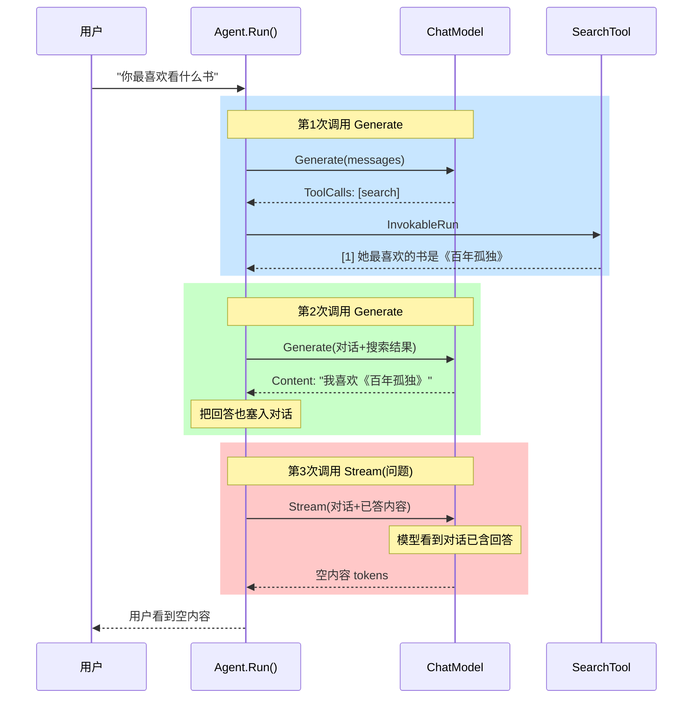
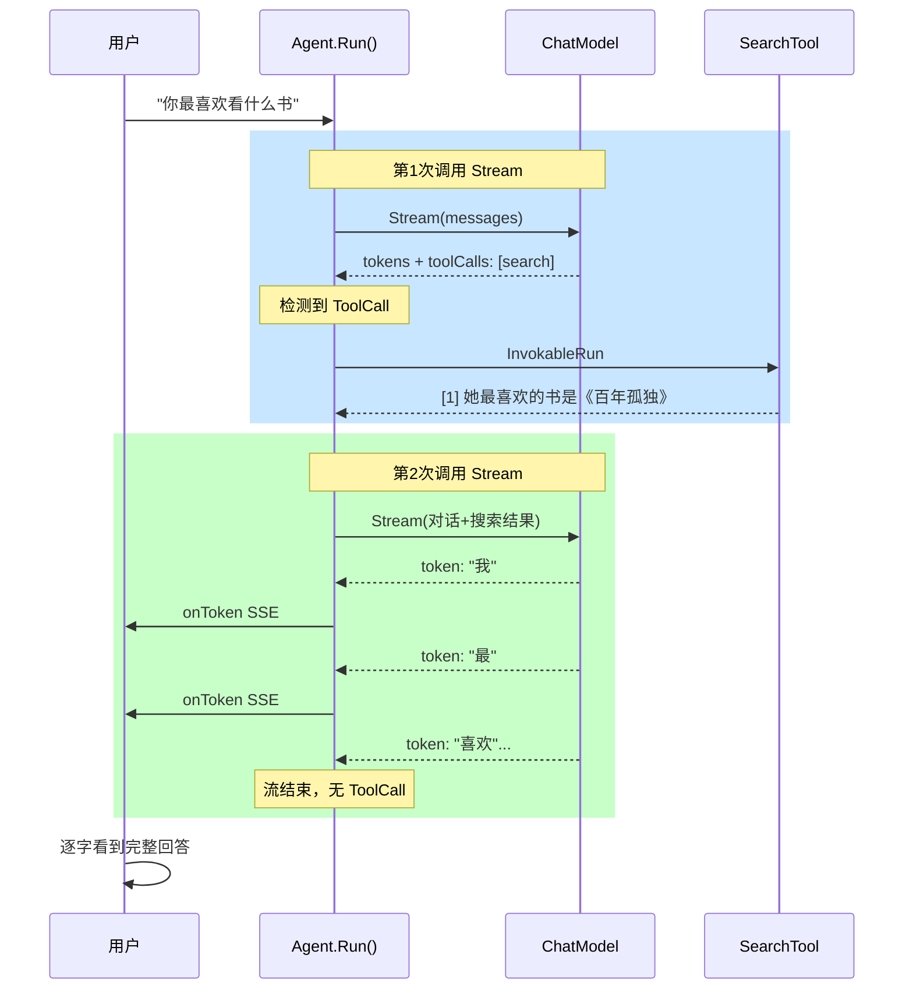

# Phase 3 — Agent 流程对比图

## 旧版本（Generate + Stream 混合）

```mermaid
sequenceDiagram
    participant U as 用户
    participant A as Agent.Run()
    participant M as ChatModel
    participant T as SearchTool

    U->>A: "你最喜欢看什么书"
    
    rect rgb(200, 230, 255)
        Note over A,M: 第1次调用  Generate
        A->>M: Generate(messages)
        M-->>A: ToolCalls: [search]
        A->>T: InvokableRun
        T-->>A: [1] 她最喜欢的书是《百年孤独》
    end
    
    rect rgb(200, 255, 200)
        Note over A,M: 第2次调用  Generate
        A->>M: Generate(对话+搜索结果)
        M-->>A: Content: "我喜欢《百年孤独》"
        Note over A: 把回答也塞入对话
    end
    
    rect rgb(255, 200, 200)
        Note over A,M: 第3次调用 Stream(问题)
        A->>M: Stream(对话+已答内容)
        Note over M: 模型看到对话已含回答
        M-->>A: 空内容 tokens
    end
    
    A-->>U: 用户看到空内容
```

## 新版本（全程 Stream）

```mermaid
sequenceDiagram
    participant U as 用户
    participant A as Agent.Run()
    participant M as ChatModel
    participant T as SearchTool

    U->>A: "你最喜欢看什么书"
    
    rect rgb(200, 230, 255)
        Note over A,M: 第1次调用  Stream
        A->>M: Stream(messages)
        M-->>A: tokens + toolCalls: [search]
        Note over A: 检测到 ToolCall
        A->>T: InvokableRun
        T-->>A: [1] 她最喜欢的书是《百年孤独》
    end
    
    rect rgb(200, 255, 200)
        Note over A,M: 第2次调用  Stream
        A->>M: Stream(对话+搜索结果)
        M-->>A: token: "我"
        A->>U: onToken SSE
        M-->>A: token: "最"
        A->>U: onToken SSE
        M-->>A: token: "喜欢"...
        Note over A: 流结束，无 ToolCall
    end
    
    U->>U: 逐字看到完整回答
```
